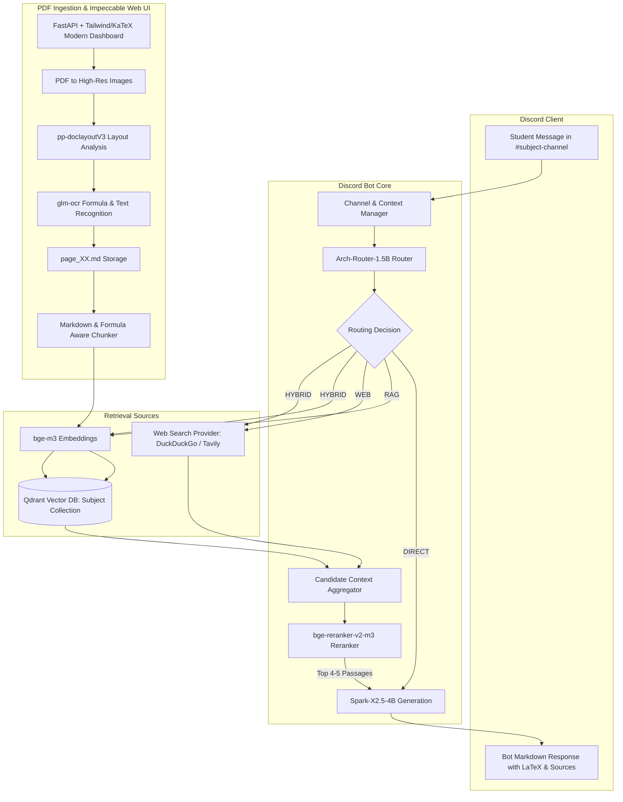

# Implementation Plan: College Study Discord Bot & Local AI Stack (with Impeccable UI/UX)

A privacy-preserving, localized college study companion featuring a Discord bot, Qdrant vector database, web search integration, and an **Impeccable, high-craft web dashboard** for PDF OCR ingestion and subject management.

---

## 1. System Overview & Model Stack

The application deploys a local model stack managed primarily via **Ollama** and dedicated Python acceleration services:

| Role | Model Name | Host / Serving Mechanism | Purpose |
| :--- | :--- | :--- | :--- |
| **Brain (LLM)** | `Spark-X2.5-4B` | Ollama (`/api/chat`, `/api/generate`) | Primary reasoning, explanation, and answer synthesis |
| **Router** | `Arch-Router-1.5B` | Ollama (`/api/generate` with structured prompt) | Classifies query intent: Direct, RAG, Web, or Hybrid |
| **Reranker** | `bge-reranker-v2-m3` | Python / Sentence-Transformers (FastAPI / local worker) | Cross-encoder reranking of retrieved context to top 4–5 items |
| **Embeddings** | `bge-m3` | Ollama (`/api/embeddings`) | 1024-dim dense/hybrid vector embeddings for Qdrant |
| **Document Layout** | `pp-doclayoutV3` | Python / PaddleOCR / ONNX | Page layout analysis (identifying formula regions, tables, text) |
| **Formula & OCR** | `glm-ocr` | Python / Transformers | High-accuracy text and LaTeX math formula extraction |

---

## 2. Web Application UI/UX Design System (UI/UX Pro Max & Impeccable)

Applying **UI/UX Pro Max** design intelligence and **Impeccable** craft principles for an **Operate Mode** productivity tool:

### A. Design Tokens & Visual Hierarchy
- **Theme**: Deep Slate / Obsidian Dark Mode (`#090D16` / `#0F172A`).
- **Surface Elevation**:
  - Base background: `#090D16` (neutral deep charcoal)
  - Card / Panel background: `#131B2E` with 1px border `rgba(148, 163, 184, 0.12)`
  - Active / Hover highlight: `rgba(255, 255, 255, 0.04)`
  - Primary Accent: Precision Electric Blue (`#3B82F6`)
  - Status Indicators: Emerald Green (`#10B981` online/indexed), Amber (`#F59E0B` processing), Rose (`#F43F5E` error)
- **Typography Pairing**:
  - Primary UI & Headers: **Inter** (weights 400, 500, 600) for pristine clarity and readability.
  - Formulas & Code Blocks: **JetBrains Mono** + **KaTeX** math engine for formula rendering.
- **Icons**:
  - 100% SVG via Lucide icons (no emojis as UI buttons or status badges).
- **Micro-Interactions**:
  - Drag-over dropzone: 150ms border glow transition (`border-blue-500/60`, subtle inner background tint).
  - Processing Stepper: Pulsing node indicator with real-time SSE progress percentage.
  - Modals & Drawers: Spring-eased slide and backdrop blur (`backdrop-blur-md`).

### B. Dashboard Layout & User Experience
The web UI is structured into three primary functional zones:
1. **Sidebar Navigation**:
   - Subject directory list with channel binding indicators (e.g. `#calculus-1` bound).
   - System Health Drawer: Live status cards for Ollama (`Spark-X2.5-4B`, `Arch-Router-1.5B`, `bge-m3`), Qdrant, and GPU VRAM meter (RTX 2060 SUPER 8GB).
2. **Main Workspace**:
   - **Header Bar**: Current subject title, total documents, total parsed Markdown pages, and vector count.
   - **Upload & Ingestion Zone**: Drag-and-drop area with file type validation (`.pdf`), batch queue, and single-click start.
   - **Live Processing Stepper (SSE)**: Visual horizontal progress nodes:
     `[PDF Split] ➔ [Layout (pp-doclayoutV3)] ➔ [OCR (glm-ocr)] ➔ [Markdown (.md)] ➔ [Embed (bge-m3)] ➔ [Indexed]`
3. **Document & Formula Inspection Studio (Split-Pane View)**:
   - Left Pane: Original PDF page thumbnail/render.
   - Right Pane: Generated Markdown with real-time KaTeX formula preview (`$$E = mc^2$$`) and a toggle for Raw Markdown editing/corrections.

---

## 3. Architecture & Data Flow



---

## 4. Hardware Optimization & VRAM Strategy (8GB VRAM)

- **Ollama**: Dynamic model loading and offloading configured with `OLLAMA_NUM_PARALLEL=1` and `OLLAMA_KEEP_ALIVE=5m`.
- **Reranker (`bge-reranker-v2-m3`)**: Loaded with FP16 precision, evaluated in batches, with dynamic CPU fallback if GPU VRAM is pressured.
- **OCR Engine (`pp-doclayoutV3` + `glm-ocr`)**: Runs asynchronously during PDF ingestion with memory isolation so Discord bot query generation is never starved.

---

## 5. Project Directory Layout

```
Discord bot/
├── docker-compose.yml             # Qdrant vector database container
├── config.yaml                    # Discord token, Ollama URL, Qdrant host, ports
├── .env.example                   # Environment variables template
├── requirements.txt               # Python dependencies
├── PLAN.md                        # Master project specification (this file)
├── src/
│   ├── bot/                       # Discord bot handlers & slash commands
│   │   ├── bot.py                 # Bot entrypoint & event loop
│   │   ├── cogs/
│   │   │   ├── study_chat.py      # Core chat & prompt handling
│   │   │   └── admin.py           # Subject binding & diagnostics
│   │   └── channel_manager.py     # Channel <-> Subject state manager
│   ├── core/                      # Model wrappers & AI connectors
│   │   ├── ollama_client.py       # Spark-X2.5-4B & bge-m3 client
│   │   ├── router.py              # Arch-Router-1.5B intent classification
│   │   ├── reranker.py            # bge-reranker-v2-m3 scoring & top-5 selection
│   │   └── search.py              # Web search engine (DuckDuckGo/Tavily)
│   ├── rag/                       # Vector retrieval & chunking
│   │   ├── qdrant_manager.py      # Qdrant client, collections, upsert & search
│   │   ├── chunker.py             # Formula-preserving Markdown chunker
│   │   └── pipeline.py            # End-to-end RAG retriever
│   ├── ingestion/                 # PDF processing & OCR engine
│   │   ├── layout_engine.py       # pp-doclayoutV3 layout detection
│   │   ├── ocr_engine.py          # glm-ocr formula & text extraction
│   │   ├── pdf_processor.py       # PDF to image & batch worker
│   │   └── pipeline.py            # Orchestrator: PDF -> OCR -> .md -> Qdrant
│   └── web/                       # Impeccable Web Management Dashboard
│       ├── app.py                 # FastAPI application & API endpoints
│       ├── templates/
│       │   └── index.html         # Modern dark dashboard template
│       └── static/
│           ├── css/dashboard.css  # Swiss/Slate design tokens & styles
│           └── js/dashboard.js    # Drag-and-drop, SSE listener, KaTeX render
├── storage/                       # Local file storage
│   └── subjects/                  # Per-subject uploaded PDFs and generated .md files
└── tests/                         # Unit and integration test suites
```

---

## 6. Implementation Phases

1. **Phase 1: Environment & Infrastructure Setup**
   - Setup `docker-compose.yml` for local Qdrant.
   - Setup virtual environment, `requirements.txt`, `config.yaml`, and `.env`.
   - Validate Ollama service and models.

2. **Phase 2: Core Model Connectors & RAG Engine**
   - Implement `ollama_client.py`, `router.py`, `reranker.py`, and `search.py`.
   - Implement `qdrant_manager.py` and formula-safe `chunker.py`.

3. **Phase 3: Impeccable Web Application & OCR Ingestion Pipeline**
   - Build FastAPI backend with SSE streaming for real-time ingestion status.
   - Build frontend applying Swiss/Slate Dark tokens, Inter + JetBrains Mono, KaTeX math preview, and split-pane PDF vs Markdown inspection.
   - Implement `pp-doclayoutV3` + `glm-ocr` page-by-page pipeline saving `.md` files.

4. **Phase 4: Discord Bot Integration**
   - Implement `bot.py` with multi-channel subject bindings.
   - Implement study chat cog: Router ➔ (Direct / RAG / Web / Hybrid) ➔ Reranker Top 4-5 ➔ Spark-X2.5-4B ➔ Discord reply.

5. **Phase 5: Verification & End-to-End Testing**
   - Test PDF upload, formula OCR parsing, and Qdrant ingestion.
   - Test Discord bot interactions across all routing paths.
